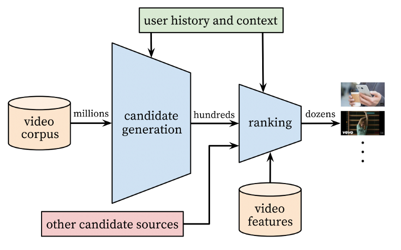

[GitHub](https://github.com/dteck/YTSentiment) Repository

```{r setup, include=FALSE}
knitr::opts_chunk$set(echo = TRUE)
knitr::opts_chunk$set(cache=TRUE)
```

## Introduction

This report will cover a method for improving YouTube recommendations based on natural language processing and sentiment analysis. The goal is to improve the ranking of recommended videos by evaluating the emotions that a video evokes in those that comment on it against the emotions expressed in the comments of a list of recommended videos. It is not meant to be a replacement for the deep neural network that Google uses to build its recommendations. It is simply meant to demonstrate the a potential for incorporating sentiment analysis as part of the ranking system for serving recommendations to users.   
This project requires some background knowledge of YouTube and how it generates its recommendations. In 2016 Google released a paper titled ["Deep Neural Networks for YouTube Recommendations"](https://ai.google/research/pubs/pub45530) where it outlines its use of two deep neural nets to build and rank recommendations. This paper covers the processes they use in great detail unfortunately however it reads like an academic journal article.  
In 2018 Moin Nadeem a then Junior at the Massachusetts Institute of Technology (MIT) wrote a more human friendly overview of the topics covered in the Google paper for the website Towards Data Science titled simply ["How YouTube Recommends Videos"](https://towardsdatascience.com/how-youtube-recommends-videos-b6e003a5ab2f).    
A brief overview is that Google uses two deep neural networks to create suggestions. The first looks at things like videos previously watched, search history, and demographics to narrow down the pool of videos to be ranked. The second neural net incorporates additional features such as preview image and peer interest and uses that to order the list of recommendations (Nadeem 2018). The goal of these networks is to maximize watch time. A diagram of this process is included below.

```{r YTdiag, echo=FALSE, out.width = '70%'}

print("Diagram of YouTube Deep Neural Networks (Nadeem 2018)")
```


At the end of April 2019 news reports such as ["Alphabet had more than $70 billion in market cap wiped out, and it says YouTube is one of the problems"](https://www.cnbc.com/2019/04/30/youtube-algorithm-changes-negatively-impact-google-ad-revenue.html) began to appear. These articles blame a dip in YouTube engagement and ad revenue for the drop in market value. They also indicate that YouTube’s recent efforts to curb fake news and conspiracy theories may be to blame for the drop in engagement. It may be that adding sentiment analysis could help improve engagement again by connecting users with content that matches emotional tones.  

##Analysis
**Note: ** To properly run the code in this analysis an API key is required. Instructions on how to acquire an API key can be found here: ["YouTube Data API Overview"](https://developers.google.com/youtube/v3/getting-started). This file will not be provided on the [GitHub](https://github.com/dteck/YTSentiment) Repository for this paper. A copy of this script for those who wish to set up their own API key is available on my GitHub as [SentimentRanker_wKey.R]( https://raw.githubusercontent.com/dteck/YTSentiment/master/SentimentRanker_wKey.R) All of the API calls rely on the TubeR package to handle the Oauth token.   
There is also an issue of reproducibility. The suggestions served to me in this report will almost certainly not be reproducible by anyone else. They are generated by the aforementioned deep neural nets and as such are tailored to what YouTube believes would best maximize my watch time. To counter this issue for the report I have created RDS files of any data that needs to be pulled from YouTube. The code for this report and the accompanying R script will call these RDS files rather than making the API calls. To examine how the API calls work see the script provided for those with keys.
 
Before running the script make sure you have the following RDS files in your working directory.

1.  [RelatedVids.rds](https://github.com/dteck/YTSentiment/raw/master/RelatedVids.rds)
2.	[BaseVid.rds](https://github.com/dteck/YTSentiment/raw/master/baseVid.rds)
3.	[BaseDetail.rds](https://github.com/dteck/YTSentiment/raw/master/BaseDetail.rds)
4.	[RelatedComm.rds](https://github.com/dteck/YTSentiment/raw/master/RelatedComm.rds)

There are several packages we will require to start our analysis. This code will install and load them.
```{r Libraries,  warning=FALSE, message=FALSE}
if (!require(tuber)) install.packages('tuber')
if (!require(syuzhet)) install.packages('syuzhet')
if (!require(ggplot2)) install.packages('ggplot2')
if (!require(tidyverse)) install.packages('tidyverse')
if (!require(knitr)) install.packages('knitr')
if (!require(kableExtra)) install.packages('kableExtra')
library(tuber)
library(syuzhet)
library(ggplot2)
library(tidyverse)
library(knitr)
library(kableExtra)
```


Once the packages are installed and loaded the script would check to make sure you have an API key installed. If you did not it would display a URL where you could learn how to set one up. If it did find a key RDS it would load the file and setup the Oauth token. It would then direct you to a website to authorize the app to access your account. Since you are not expected to set up an API key this code is only shown as an example. 
```{r APIKeyLoad, eval=FALSE}
APIKey<-file_test("-f","APIKey.rds") #test if apikey exists
if (APIKey == FALSE) { #run code block if apikey does not exist
  print("No youtube API Key")
  print("See https://developers.google.com/youtube/v3/getting-started")
  print("expects key as RDS data.frame in form 
        APIKey<-data.frame(app_id='Your App ID Here', 
        app_secret = 'Your App Secret Here')")
  rm(APIKey) #removes file test
}else { #run code block if api key exists
  APIKey<-readRDS("APIKey.rds") #read API key
  yt_oauth(app_id=APIKey$app_id, 
           app_secret = APIKey$app_secret, token = "") #load key to memory
}
```


Now that the API key is glossed over, it’s time to pick a video that we want recommendations for. For this report I will be using a video from the cooking channel [Binging With Babish](https://www.youtube.com/channel/UCJHA_jMfCvEnv-3kRjTCQXw) where he attempts to recreate [Jake's Perfect Sandwich from Adventure Time](https://www.youtube.com/watch?v=HsxBw6ls7Z0). The following code is where the URL for the video we like is entered. This is referred to as the “Base” video from this point on.
```{r BaseVideoLink}
Baselink<-"https://www.youtube.com/watch?v=HsxBw6ls7Z0" #link to a liked youtube video
```

Once the base video URL is entered, we need to separate out the Video ID. This is the string of alphanumeric characters after the "=" in the URL. A regular expression is used to select everything past the "=" sign and save it for use with the API calls.
```{r BaseVideoID}
Baselink<-str_match(Baselink,"[^=]+$") #regex to extract video ID
```

With the Video ID isolated we can begin making calls to the YouTube API and pulling data down for analysis. Again, the code is shown as an example but the [RelatedVids.rds](https://github.com/dteck/YTSentiment/raw/master/RelatedVids.rds) will be loaded with the results of the API calls.
```{r BaseVideoInfo, warning=FALSE, message=FALSE, results='hide', eval=FALSE}
RelatedVids<- get_related_videos(video_id =Baselink, max_results = 11) #pull recomended
```
```{r BaseVideoRDS, warning=FALSE, message=FALSE, results='hide'}
RelatedVids<- readRDS("RelatedVids.rds") #Load RDS with API results
```

This call returns a list of videos with 17 variables. To view the list we will only display the two most releveant variables Video ID and Title.
```{r BaseVideoTable}
RelatedTable<-RelatedVids[,c("rel_video_id","title")]
kable(RelatedTable) %>% 
  kable_styling(latex_options="scale_down")
```


Now that the list of reccomendations is stored we can begin analyzing our Base video. We are going to want to grab all of the comments for the Base video. We will also get the deatils for the Base video and extract the Title of the video for use later.
```{r BaseVideoDetails, warning=FALSE, message=FALSE, results='hide'}
yt_oauth(app_id=APIKey$app_id, 
         app_secret = APIKey$app_secret, token = "")
#Markdown has issues with chunk execution order so the key may need to be re entered
baseVid<-get_all_comments(video_id = Baselink) #get the comments from that video
BaseDetail<-get_video_details(video_id = Baselink)#pull details of the base video
BaseTitle<-BaseDetail$items[[1]]$snippet$title #extract the title of the base video
```

The API call to get all comments tells us that the Base video has ```r  length(baseVid$id) ``` comments. The Video Details call gives us basic information like the video description, thumbnail urls, video tags, and title. A quick view of the relevant parts of the comments section shows us things like who made the comment, what the comment said, and how many poeple liked the comment. We can take a look at the top rated comments. After sanitizing the unicode characters since LaTex does not like them.

```{r BaseCommentTable}
BaseCommentTable<-baseVid[,c("authorDisplayName" ,"textOriginal","likeCount")]
BaseCommentTable$textOriginal<-iconv(BaseCommentTable$textOriginal, to="ASCII")
BaseCommentTable$authorDisplayName<-iconv(BaseCommentTable$authorDisplayName, to="ASCII")
BaseCommentTable$likeCount<-as.numeric(BaseCommentTable$likeCount)
BaseCommentTable <- BaseCommentTable[order(BaseCommentTable$likeCount, decreasing = TRUE),]
kable(head(BaseCommentTable,10)) %>%  kable_styling(latex_options="scale_down")
```

Now that we have the comments for the base video ready to go we can start getting them ready to feed n our sentiment analysis engine. In this case we will be using the [syuzhet](https://cran.r-project.org/web/packages/syuzhet/index.html) package. and its nrc_sentiment() function. This fucntion loads a dictionary of words that have been tagged with a set of emotions and Calls calcualts the presenace and the valance either positive or negative. The NRC Word-Emotion Association Lexicon was built by Saif Mohammad and the National Research Council of Canada. More information about it can be found here: [NRC Emotion Lexicon](https://saifmohammad.com/WebPages/NRC-Emotion-Lexicon.htm). We can look at the first few rows to see what the results are.
```{r SanitarySentiment, cache=TRUE}
#sanitize the text by converting to utf-8
baseVid$sanitary<-iconv(baseVid$textOriginal, to="UTF-8")
#get emotional levels from each comment
BaseEmo<-get_nrc_sentiment(baseVid$sanitary)
kable(head(BaseEmo,10)) %>%  kable_styling(latex_options="scale_down")
```

These logicals are intereting but not very useful on theor own. We are more interested in the emotions people are expressing overall. To find that we can take the average of each of these columns and get a sort of emotional profile.
```{r BaseEmotionalAverage, cache=TRUE}
#create averages of sentiment and emotion for base video
Baseavg<-apply(BaseEmo, 2, mean)
#convert averages to data frame for plotting
Baseavg<-data.frame(name=Baseavg)
kable(Baseavg)
```

Now we want to make a graph showing these averages so we can understand what we are looking at. We will also include the Title of the video and the Video ID.
```{r BaseEmotionalPlot, cache=TRUE}
#plot the emotional sentiment averages
Avg<-ggplot(Baseavg, aes_(x=row.names(Baseavg), y=Baseavg$name,
fill=row.names(Baseavg)))+geom_bar(stat="identity")+theme(legend.position="none",
                       axis.title.x=element_blank(),axis.title.y=element_blank())
Avg+ggtitle(BaseTitle,paste("Video ID: ",baseVid$videoId[1]))
```
Here we can see that the comments are overwhelimigly positive. While Anticipation, Joy, Negativity, and Trust were all about equally represented. This graphs represents the general level of different emotions expressed by people who commented on the video. This gives us the emotional profile we will be attempting to match across the set of videos YouTube reccomends to us.  

the next step is to use the API to pull the comments for our list of reccomended videos. The following code will build a list of data frames that contain all of the comments for the reccomended videos. For this report it will also display the number of comments on each of the related videos.
```{r RelatedComments, cache=TRUE}
yt_oauth(app_id=APIKey$app_id, 
         app_secret = APIKey$app_secret, token = "")
#Markdown has issues with chunk execution order so the key may need to be re entered
seq<-1:length(RelatedVids$rel_video_id) #set iteration length
RelatedComm<-list() #initalize a list for the related video comments
for (n in seq){ #get comments,sanitize by converting to UTF-8 format
  RelatedComm[[n]]<-get_all_comments(video_id = as.character(RelatedVids$rel_video_id[n]))
  RelatedComm[[n]]$sanitary<-iconv(RelatedComm[[n]]$textOriginal, to="UTF-8")
  RelatedComm[[n]]$likeCount<-as.numeric(RelatedComm[[n]]$likeCount)
  RelatedTable$Comments[n]<-length(RelatedComm[[n]]$id)
}
rm(n,seq) #remove n and sequence used to itterate over list
kable(RelatedTable) %>% 
  kable_styling(latex_options="scale_down")
```

Now we need to go entry by entry on the list and get the NRC sentiments. This code will perform that function. A word of caution this process can take some some if there is a large numebr of caomments. 
```{r RelatedSentimentsAll, cache=TRUE}
seq<-1:length(RelatedVids$rel_video_id) #set iteration length
RelatedEmo<-list()
for (n in seq){ #itterate over all comments and get emotional sentiment
  RelatedEmo[[n]]<-get_nrc_sentiment(RelatedComm[[n]]$sanitary)
}
rm(n,seq) 
```

Once the sentiments are calucalted we need to build the averages of those sentiments.
```{r RelatedAvgAll, cache=TRUE}
seq<-1:length(RelatedEmo) #set iteration length
RelatedEmoAvg<-list() 
for (n in seq){ #calulate averages of emotional senitment
  RelatedEmoAvg[[n]]<-apply(RelatedEmo[[n]][1:10], 2, mean)
}
rm(n,seq)
```


Here there is a bit of data reshaoing going on. The list of related video emotional averages needs to be converted from a list to a data frame. We also want to add the video IDs to the list so we can keep track of which video is which. 
```{r RelatedEmoTranspose, cache=TRUE}
RelatedEmoAvg<-data.frame(RelatedEmoAvg) #reshape the dataframe
RelatedEmoAvg<-data.frame(t(RelatedEmoAvg))
rownames(RelatedEmoAvg)<-RelatedVids$rel_video_id #set row names
kable(RelatedEmoAvg) %>% 
  kable_styling(latex_options="scale_down")
```

With all of the comments now converted to averages we need to rank the videos. We do this by calcualting the absolute differences then ranking each emotion and each video. This again will rely on a considerable amount of data reshaping to properly rank all of the elements. This next bit of code starts the process by clauclating the absolute differences of each emotion from the Base video average.
```{r AbsoluteEmo, cache=TRUE}
Baseavg<-data.frame(t(Baseavg)) #transpose the baseavg df
AbsoluteEmo<-data.frame() #initialize ABS difference dataframe
seq<-1:length(RelatedEmo) 
for (n in seq){ #calculate difference between base emotions and related video emotions
  AbsoluteEmoTemp<-abs(Baseavg[1,]-RelatedEmoAvg[n,])
  AbsoluteEmo<-rbind(AbsoluteEmo,AbsoluteEmoTemp)
}
rm(n,seq,AbsoluteEmoTemp) 
rownames(AbsoluteEmo)<-RelatedVids$rel_video_id #set row names
kable(AbsoluteEmo) %>% 
  kable_styling(latex_options="scale_down")
```

With the table of absolute differences we can now begin reshaping and ranking the data. The idea here is that we want to rotate the data frame above so that each emotion is a row and each video is a column. Then we want to rank each columns values. The larger the value the higher its rank, becuase ranking happens in accending order.

For example if a video had the exact same level of trust as the base video it would rank that videos trust as a 1. If that same video have a very different level of anger it would rank it a 10. 
```{r BuildRanks, cache=TRUE}
AbsoluteEmo<-data.frame(t(AbsoluteEmo)) #transpose dataframe
AbsoluteEmo<-apply(AbsoluteEmo,2,rank) #get rank of abs diff for each emotion by video
kable(AbsoluteEmo) %>% 
  kable_styling(latex_options="scale_down")
```

Now we want to rotate it back to the original shape so each video is a row and each emotion is a column. 
```{r BuildRanks2, cache=TRUE}
AbsoluteEmo<-t(AbsoluteEmo) #transose dataframe
kable(AbsoluteEmo) %>% 
  kable_styling(latex_options="scale_down")
```

We then rank across the columns again to get an index of which videos most closely matched the Base videos emotion 
```{r BuildRanks3, cache=TRUE}
AbsoluteEmo<-apply(AbsoluteEmo,2,rank) #rank columns to get rank of each emotion for all 
AbsoluteEmo<-data.frame(AbsoluteEmo) #convert back to dataframe
kable(AbsoluteEmo) %>% 
  kable_styling(latex_options="scale_down")
```

We then want to to add the sum of each row as a new column.
```{r BuildRanks4, cache=TRUE}
AbsoluteEmo$sum<-rowSums(AbsoluteEmo) #add sum of rows
kable(t(AbsoluteEmo$sum))
```

next we add some more columns like the video titles and build a link to each item on the list.
```{r BuildRanks5, cache=TRUE}
AbsoluteEmo$title<-RelatedVids$title #add titles to emo df
AbsoluteEmo$link<-paste("https://www.youtube.com/watch?v=",
RelatedVids$rel_video_id, sep="") #build links to videos
```

Finally we rank the row sums to build our final list. 
```{r RankedList, cache=TRUE}
RankedList<-data.frame(rank=rank(AbsoluteEmo$sum, ties.method ="first"),
title=AbsoluteEmo$title,link=AbsoluteEmo$link) 
#generate a list of recommended videos and rank of best emotional fit
kable(RankedList) %>% 
  kable_styling(latex_options="scale_down")
```

From this ranked list we may want to see how close the top reccomedation video is to our Base emmotional profile. The following code plots the best ranked reccomended vdeio emotion profile against our Base videos profile. 
```{r TopReccPlot, cache=TRUE}
TopRank<-which.min(RankedList$rank)# get the topranked video index value
ClosestMatch<-RelatedEmoAvg[which.min(RankedList$rank),] 
#pull emotional avg values from closest match
ClosestMatch<-data.frame(t(ClosestMatch)) #transpose df
colnames(ClosestMatch)<-"1" #set column name to set value for graphing
Recc<-Avg+geom_point(data=ClosestMatch,aes(shape=18, size=5, y=ClosestMatch$'1', 
x=colnames(Baseavg)))+scale_shape_identity()+ggtitle(paste(BaseTitle,"-",
baseVid$videoId[1]),paste("Reccomended Video: ",
RelatedVids$title[TopRank]," - ",
RelatedVids$rel_video_id[TopRank]))
#add to ggplot to show how close best match video is
Recc
```

from this graph we can see that the reccomendation is quite close in several of the emotional categories.  
As a final grpahical display it might be interesting to plot all of the reccomendations to see what kind of variability there was.
```{r ReccPlotAll, cache=TRUE}
RelatedEmoAvgTrans<-data.frame(t(RelatedEmoAvg)) # reshape df for graphing
seq<-c(1:length(RelatedVids$rel_video_id)) #set number of itterations
for (n in seq){ #add data points for each video to the graph to show spread.
  Recc<-Recc+geom_point(data=RelatedEmoAvgTrans,aes_(y=RelatedEmoAvgTrans[,n]))
}
rm(n,seq) 
Recc #display final graph
```

Now the list is built it is saved as CSV in the working directory. 
```{r SaveList}
write.csv(RankedList,"RankedList.csv", row.names = FALSE) #output ranked list to csv
```


##Results

In the table below we can see that we were able to adjust the rankings that YouTube provided (first column). This means it could be a possible avenue for inclusing in the ranknig system that YouTube uses to reccomend videos to users.
```{r DisplayList, cache=TRUE}
kable(RankedList[order(RankedList$rank),]) %>% 
  kable_styling(latex_options="scale_down")
```


##Conclusion
We have found that there is room to improve the reccomendations for videos served by YouTube with the additon of natural language processing to match emotional tones across suggestions. It also raises the possibiltiy of using these methods to build sentiment profiles of users. Combine the sentinments of every comment they leave. As well as for every video they like. Find what emotions they are drawn to and feed that back to them.  
There is a consideration that shold be made for perfomance. This paper is a proof of concept and woudl nto be the most efficent way to impliment this type fo ranking. It would make more sense for YouTube to build its own lexicon that is specific to its comments. This would allow them to get more accurate results reguarding expression of emotions and valance of comments.  
They shoudl also consider running the sentiment analysis across all comments currently available and going forward when a user submits a comment or edits one it does the sentiment processign then and simpyl saves the numeric results. These logicals could then be quickly processed when building reccomendations.  
As a further step when auto translation becomes more robust sentiment analysis could be run across the video transcripts to better match content emotion to a users preference. All of these steps may help improve YouTubes core metric of watch time. But barring prooper A/B testing which is outside of the scope of this paper the exact impact is unknonwn.